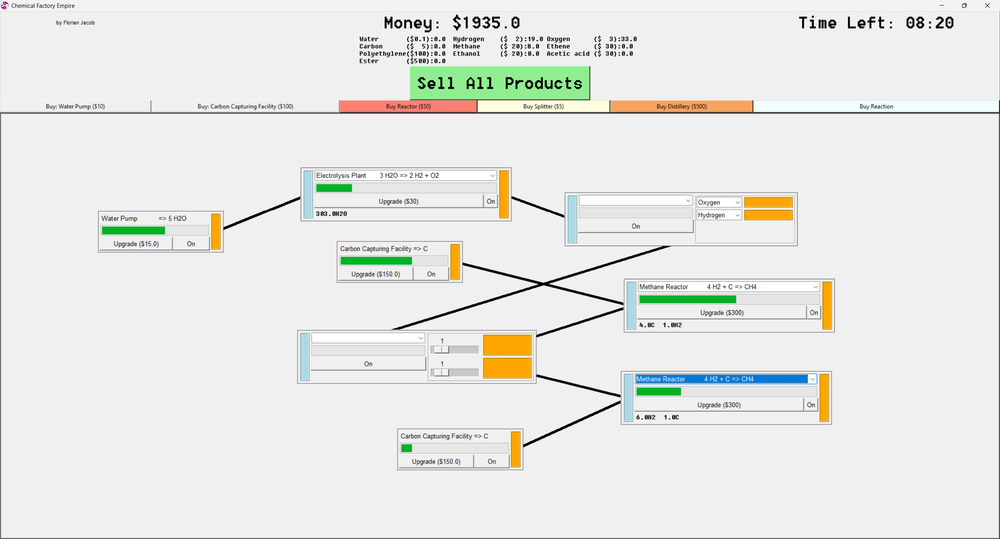
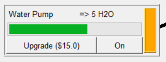
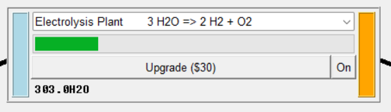
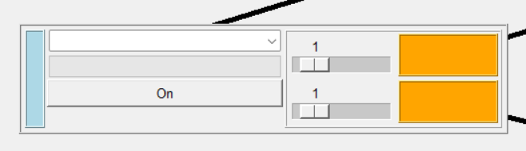
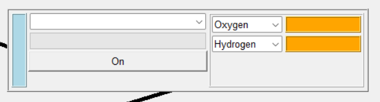

# Factory Minigame

This is a simple simulation game, that is highly configurable. Mainly for usage
in chemistry and process engineering education.

## Explanation of the Interface

The top contains the author, the current balance as well as the time left.
Depending on the mode, there are 2 timeframe: 10 minutes for a quick game and 60
for a longer one. Both are recorded separately in the highscores.\
Below the money, there is the current storage of chemicals and there worth. Look
at how much each material is worth, to decide what process gives you the best
money. To get the money for all the materials, simply hit the big green sell
button. Currently, there is not really a reason to keep resources in stock,
since you can't get the back in the process.\
Below the sell button, there are different facilities that can be bought.

### Production Facility

\
The gray buttons allow to purchase production facilities. They don't require any
input and can be upgraded for faster production speed. Like all facilities, it
has a toggle button and is turned off by default.

### Reactor

\
The red button allows to purchase reactors. The process one or multiple
chemicals to others. To select the reaction, use the dropdown menu in the
center. More reactions can be purchased with the light blue button. The reactor
can be upgraded for fast processing, but changing the reaction looses the
upgrades. Like all facilities, it has a toggle button and is turned off by
default.

### Splitter

\
The yellow button allows to purchase splitters. They are used to split up
stream, similar to a pipe junction. They are rather cheap, allowing to buy the
as much as needed. Sadly, they are rather large, limiting the usable amount. The
dropdown menu can be used to select the wanted amount of outputs, the sliders
can weight the outputs. For example, when one is set to $2$ and one to $1$,
then $2/3$ go in the first one, $1/3$ in the other. Like all facilities, it has
a toggle button and is turned off by default.

### Distillery

\
The orange button can be used to purchase a distillery. It is used to split up
the different species. The central dropdown menu can be used to select the
number of outputs, while each output can specify a species to output. Only the
first output will be used to output a species, so the distillery can not be used
as a splitter. Like all facilities, it has a toggle button and is turned off by
default.

## Set up a factory

The beginning of all factories should be one or more production facilities. For
the default setup, you should start with a pump, since it is cheap and produces
large amounts of water. Since one pump produces way more water than an
Electrolysis plant can handle, the streams should be split up with splitter.\
To move facilities, click on their progress bar and move them around. To connect
two facilities, click the mouse on the orange output field of the facility and
drag the line to the blue input of another facility. When the line is dropped,
it should turn black if both facilities are connected. Now, when ever the
facility produces an output, it will be transported as input into the other one.
After splitting the stream, you can now supply multiple Electrolysis plants to
produce hydrogen and oxygen. This will give you some money to get started and
move on from here, since most Hydrocarbons will need the hydrogen produced in
the setup.

## Additional Features

- You can zoom in and out when you scroll using your mouse wheel inside the
  factory frame. Sadly, this feature is limited by the possibilities provided by
  python.
- You can move around in the factory by holding clicking and moving the mouse
  button in the while inside the factory frame.
- You can click on the species in the chemicals in the storage section. That 
  way, a production path interface will be opened, that shows you different 
  ways to obtain the chemical you clicked on. These paths may be larger than 
  your screen, when the reaction network grows to large. Currently, circular 
  reaction, for example catalytic reactions, can not be represented.
